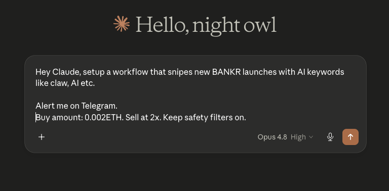

<p align="center">
  
</p>

# ctrl-mcp

> the mcp for on-chain automation. sign once, agent does the rest, forever.

ctrl is workflow automation for on-chain actions on base. you compose **trigger → action → condition** graphs in plain english, sign one batch to deploy a vault + spending caps, and a keeper runs your workflow under those caps forever.

this is the mcp surface. agents talk to it. users sign in their wallet.

```bash
$ claude mcp add ctrl https://ctrl.build/api/mcp
```

or paste into your client's mcp config:

```json
{
  "mcpServers": {
    "ctrl": {
      "command": "npx",
      "args": ["-y", "mcp-remote", "https://ctrl.build/api/mcp",
               "--header", "Authorization:Bearer ${CTRL_API_KEY}"],
      "env": { "CTRL_API_KEY": "sk_ctrl_..." }
    }
  }
}
```

mint a key at [ctrl.build/settings/api-keys](https://ctrl.build/settings/api-keys).

## prompt your agent. that's it.

<p align="center">
  
</p>

## what your agent gets

seven tools. that's it.

| tool | what it does |
|---|---|
| `ctrl_get_vault_status` | read user's vault address, balance, active rules |
| `ctrl_get_block_catalog` | live list of every block + field schema |
| `ctrl_create_workflow` | assemble + save a workflow draft from a prompt |
| `ctrl_activate` | encode the eip-5792 batch the user signs to deploy |
| `ctrl_withdraw` | encode the batch to pull funds out of the vault back to the user's wallet (eth, weth, or any erc-20) |
| `ctrl_fire_manual` | fire a workflow once for testing — no waiting |
| `ctrl_get_execution_logs` | basescan tx hashes, gas, status — keeper history |

## 24 blocks under the hood

**triggers** — `time.interval`, `trigger.manual`, `price.above/below/change`, `pool.created` (clanker / flaunch / zora / bankr), `watch.whale`, `event.transfer`, `event.balance`, `trending.token`

**actions** — `cypher.swap`, `read.balance`, `notify.telegram`, `notify.discord`, `util.webhook`

**conditions** — `cond.price`, `cond.balance`, `cond.allowed_weekdays`, `cond.time_window`

**utilities** — `util.delay`, `util.note`, `util.log`, `util.stop`, `util.snapshot`

the agent calls `ctrl_get_block_catalog` first to see the live shape. every block id maps 1:1 to keeper execution.

## example prompts

drop these into your agent and watch:

- "dca $50 eth into usdc every monday at 14:00 utc"
- "snipe new flaunch launches with `milady` in the name, 0.005 eth each, auto-sell at 2x"
- "watch wallet 0x6cc5...c01b. when they buy anything over $10k, copy with 0.01 eth"
- "sell 50% of my pepe if price drops 20% in an hour"
- "every monday noon, check moonwell usdc apy. if lower than morpho by 1%, move 80%"

## security

vault-direct model. agent never holds keys.

- on-chain caps: every rule signs immutable `maxPerSwap` + `maxPerDay`. enforced by the vault contract.
- kill switches: `pauseVault()` halts everything; `revokeRule(id)` kills one workflow. both 1-tx, user-callable.
- safety primitives: `pool.created` runs goplus honeypot + tax + score checks before any swap.
- keeper bounded: the keeper fleet can only call methods the vault permits. compromised keeper costs at most one tick's per-swap cap.

verified contracts on base:
- v13 vault factory — [0x5Df25e79efd7f9dc86841b404b3EA6F4b7951DBB](https://basescan.org/address/0x5Df25e79efd7f9dc86841b404b3EA6F4b7951DBB)
- vault implementation — [0x48d16fe4d11499E6714840e101943F0f2FDacB5a](https://basescan.org/address/0x48d16fe4d11499E6714840e101943F0f2FDacB5a)
- timelock beacon — [0x5760A6D62743860F27843fA314E22166dBEF7d73](https://basescan.org/address/0x5760A6D62743860F27843fA314E22166dBEF7d73)

## ecosystem

works with any mcp client. tested with:
- claude code · `~/.claude.json`
- claude desktop · `~/Library/Application Support/Claude/claude_desktop_config.json`
- cursor · `~/.cursor/mcp.json`
- hermes ([nousresearch/hermes-agent](https://github.com/nousresearch/hermes-agent))
- aeon ([aaronjmars/aeon](https://github.com/aaronjmars/aeon))

---

- app · [ctrl.build](https://ctrl.build)
- docs · [ctrl.build/docs](https://ctrl.build/docs)
- mcp hub · [ctrl.build/mcp](https://ctrl.build/mcp)
- sibling repo · [ctrl-skill](https://github.com/CTRLabs/ctrl-skill)

mit
